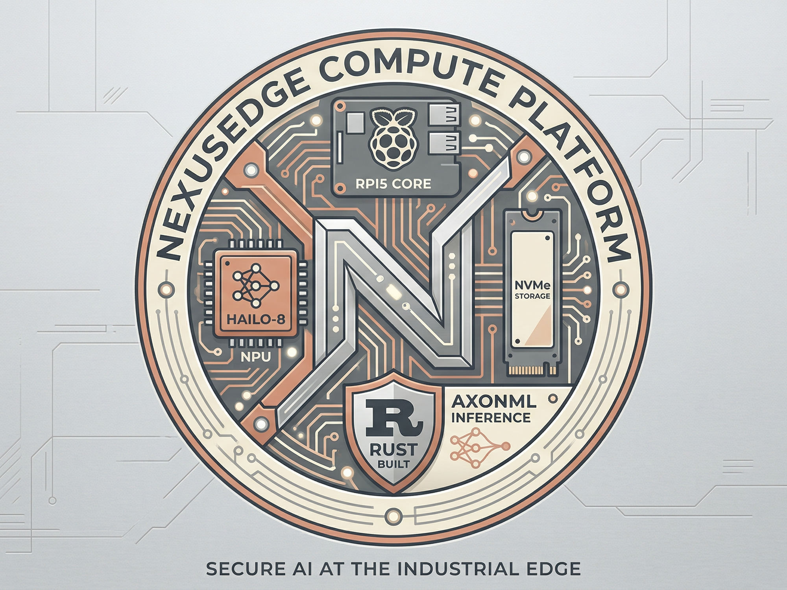

<p align="center">
  
</p>

<h1 align="center">NexusEdge Hailo Edition</h1>

<p align="center">
  <strong>Open HVAC control platform for Raspberry Pi + Hailo NPU</strong>
</p>

<p align="center">
  
  
  
  
  
  
  
</p>

<p align="center">
  
  
  
  
  
  
  
  
</p>

---

## Features

- **42 Control Algorithms** — TMC (Thermal Momentum Control), PID, On/Off, lead/lag pump/boiler/chiller, zone reheat, DOAS with DX staging, steambundle, natatorium, and more. Classical, Advanced, AI/ML, Strategy, and Safety categories.
- **24 Equipment Types** — AHU, RTU, boiler, cascade boiler, chiller, water-cooled chiller, cooling tower, pump, VFD pump pack, booster pump, heat pump, DOAS, zone reheat, commercial lighting, and more.
- **Hailo NPU Inference** — Real-time model inference for Hailo-8 and Hailo-10H accelerators. 150+ embedded HEF models (Nehebkau LSTM + Medjed GRU + Thoth fault classifier + Anubis SIEM + Sage BOW). Chip auto-detected at startup.
- **AegisDB** — 13-paradigm embedded database: Time Series, Document Store, Key-Value, Streaming, Graph, OTA Updates, Vault, Shield, Query Builder, Compliance, Admin, Auth, and Cluster. NexusCompress columnar compression.
- **NexusShield** — Security middleware, RBAC, breach detection, IP blocking, rate limiting, threat scoring. SIEM export to Syslog, Elasticsearch, Splunk HEC, and webhook destinations.
- **NexusVault** — AES-256-GCM encrypted credential storage with auto-unseal
- **Setup Wizard** — 8-step guided first-boot configuration (Site, Boards, Equipment, I/O Mapping, Algorithms, Notifications, Alarms, Review & Configure)
- **8 I/O Board Types** — MegaBAS, MegaIND, 16 Univ-In, 16 Univ-Out, 16 Relay, 8 Relay, 16 SSR, 8 RTD (Sequent Microsystems HATs)
- **Alarm Monitoring** — Threshold-based detection with configurable warning/alarm levels and history
- **Audit Trail** — Structured change logging for all control mutations with optional SIEM forwarding
- **Weather Integration** — OpenWeatherMap polling with configurable interval
- **Tauri Desktop UI** — Native window with Leptos 0.7 WASM frontend + embedded web server on port 8000
- **Remote Terminal** — Full PTY shell via WebSocket accessible through Cloudflare tunnel
- **OTA Logic Deploy** — Write logic in a sandbox editor, simulate outputs, deploy OTA with ed25519 signing. Automatic backup before overwrite, one-click rollback. Paid tier + org permission gated.
- **NexusEdge Console** — Multi-tenant fleet management with 13 pages. OTA deploy, audit trail, SIEM dashboard, fleet topology, org management, AegisDB admin.
- **3-Level RBAC** — App-level (org membership), org-level (granular permissions per member), site-level (restrict techs to specific locations). Zero cross-org, zero cross-site visibility.
- **Console Remote Push** — Controllers push metrics (15s), status + alarms (60s), audit (5m) to AN server for Console display.
- **Firebase → AegisDB Sync** — Write-through sync of all user, org, controller, and membership data.
- **Cream/Black Deployment** — Zero-downtime deployment for AN server and controller binary with auto-failover watchdog.
- **SLSA Level 3** — Supply chain attestation on all release artifacts

## Requirements

- **Fresh Raspberry Pi** — Pi 5 (Bookworm 64-bit) or Pi 4 (Bookworm 64-bit). Clean OS install, no other software.
- **Hostname: `Automata`** — Set during OS imaging or via `sudo hostnamectl set-hostname Automata`. Required — NexusEdge uses root-level ioctl for I2C hardware access and expects this user/hostname.
- **User: `Automata`** — Create this user during OS setup with password authentication enabled.
- **Hailo-8 M.2 or Hailo-10H M.2** accelerator (optional — CPU fallback available, NPU required for real-time inference)
- **Sequent Microsystems I/O HAT** — MegaBAS, MegaIND, or any of the 8 supported board types for connecting to HVAC equipment
- **Dedicated Pi** — NexusEdge should be the only application on the controller. Do not share with other services.

## Installation

Three ways to install NexusEdge on your Raspberry Pi:

### GUI Installer

Download and run the graphical installer from the [Releases](https://github.com/AutomataNexus/NexusEdgeHailoEdition/releases) page. Step-by-step branded wizard with EULA, account creation, hardware detection, and progress tracking.

### Headless Installer

```bash
# Interactive — prompts for email/password
curl -fsSL https://nexusedgehailo.automatanexus.com/install.sh | sudo bash

# Non-interactive
curl -fsSL https://nexusedgehailo.automatanexus.com/install.sh | sudo bash -s -- \
  --email you@example.com --password 'yourpass'

# With pre-made config (skip the Setup Wizard)
curl -fsSL https://nexusedgehailo.automatanexus.com/install.sh | sudo bash -s -- \
  --email you@example.com --password 'yourpass' \
  --config /path/to/configs/
```

The headless installer handles I2C/PCIe configuration, Hailo NPU detection, Sequent board firmware updates, and auto-reboots to apply hardware changes — resuming automatically after reboot.

### Configuration

NexusEdge needs two config files in `/etc/nexusedge/config/`:

| File | Purpose |
|---|---|
| `site.toml` | Site name, equipment, I/O mapping, algorithms, thresholds, weather |
| `hardware-daemon.toml` | Board types, stack addresses, poll interval |

**Option A:** Run the Setup Wizard — open `http://<pi-ip>:8000` after install and walk through the guided configuration.

**Option B:** Push pre-made configs directly:

```bash
scp site.toml hardware-daemon.toml Automata@<pi-ip>:/etc/nexusedge/config/
ssh Automata@<pi-ip> sudo systemctl restart nexusedge
```

Example configs are available in the [User Guide](https://nexusedgehailo.automatanexus.com/user-guide.html).

## Subscription Tiers

| | Community | Pro ($29/mo) | Business ($99/mo) | Enterprise ($299/mo) |
|---|---|---|---|---|
| Controllers | 1 | Up to 10 | Up to 25 | Up to 50 |
| Algorithms | 3 (TMC/PID/On-Off) | 42 | 42 | 42 |
| Audit Trail (local) | ✓ | ✓ | ✓ | ✓ |
| Thoth Fault Detection | ✓ | ✓ | ✓ | ✓ |
| OTA Logic Deploy + Sandbox | — | ✓ | ✓ | ✓ |
| NexusOracle AI Diagnostics | — | ✓ | ✓ | ✓ |
| Email + SMS Notifications | — | ✓ | ✓ | ✓ |
| BACnet/Modbus | — | ✓ | ✓ | ✓ |
| CF Tunnel + Tailscale | — | ✓ | ✓ | ✓ |
| Console (own controllers) | — | ✓ | ✓ | ✓ |
| Remote Metrics Push | — | ✓ | ✓ | ✓ |
| Fleet Console + Fleet Graph | — | — | ✓ | ✓ |
| Org RBAC + Site Access | — | — | ✓ | ✓ |
| Fleet Audit Trail (dual) | — | — | ✓ | ✓ |
| Anubis SIEM + SIEM Export | — | — | ✓ | ✓ |
| AegisDB Admin Dashboard | — | — | — | ✓ |
| GDPR Compliance Tools | — | — | — | ✓ |
| Custom Algo + Model Training | — | — | — | ✓ |

Upgrade from within the app via Settings > Subscription. Enterprise+ (50+ controllers) available on request.

## Included Models

98 embedded HEF models compiled for both Hailo-8 and Hailo-10H silicon:

| Model | Architecture | Parameters | Hailo-8 FPS | Hailo-10H FPS |
|---|---|---|---|---|
| **Medjed** (24 variants) | GRU (2L, 64h) | 53K | 5,200 | 8,400 |
| **Nehebkau** (24 variants) | LSTM (3L, 96h) | 142K | 3,100 | 5,600 |
| **Sage BOW** (2 variants) | Bag-of-Words Retriever | 18K | 12,000+ | 18,000+ |

Medjed and Nehebkau accept 12 HVAC sensor features (supply/return/space temps, OAT, valve position, fan status, setpoint, mode, humidity, delta-T, error, integral) and predict 6 control targets (valve, fan, setpoint adjustment, anomaly score, efficiency index, comfort index). One variant per equipment type. Retrain with your own data through the AxonML embedded training pipeline.

Sage BOW powers the NexusOracle AI chat and diagnostics interface (Pro).

## Documentation

- [User Guide](https://nexusedgehailo.automatanexus.com/user-guide.html) — Complete installation, configuration, and operation guide
- [Medjed Whitepaper](https://nexusedgehailo.automatanexus.com/medjed-paper.html) — GRU model architecture, training, and benchmarks
- [Nehebkau Whitepaper](https://nexusedgehailo.automatanexus.com/nehebkau-paper.html) — LSTM model architecture, training, and benchmarks
- [Sage BOW Whitepaper](https://nexusedgehailo.automatanexus.com/sage-paper.html) — Bag-of-Words retriever for on-device AI chat
- [Sobek Apex Whitepaper](https://nexusedgehailo.automatanexus.com/apex-paper.html) — MPC neural engine architecture and silicon benchmarks
- [TMC Whitepaper](https://nexusedgehailo.automatanexus.com/tmc-paper.html) — Thermal Momentum Control algorithm
- [Changelog](CHANGELOG.md)
- [Terms of Service](docs/TERMS_OF_SERVICE.md)
- [EULA](docs/EULA.md)
- [Privacy Policy](docs/PRIVACY.md)
- [Contributing](docs/CONTRIBUTING.md)
- [Security](docs/SECURITY.md)

## License

Source code: Apache License 2.0
Binary components: See [EULA.md](docs/EULA.md)

## Author

Andrew Jewell Sr. — AutomataNexus LLC
ORCID: 0009-0005-2158-7060

---

<p align="center">
  <sub>Copyright &copy; 2026 AutomataNexus LLC. All rights reserved.</sub>
</p>
